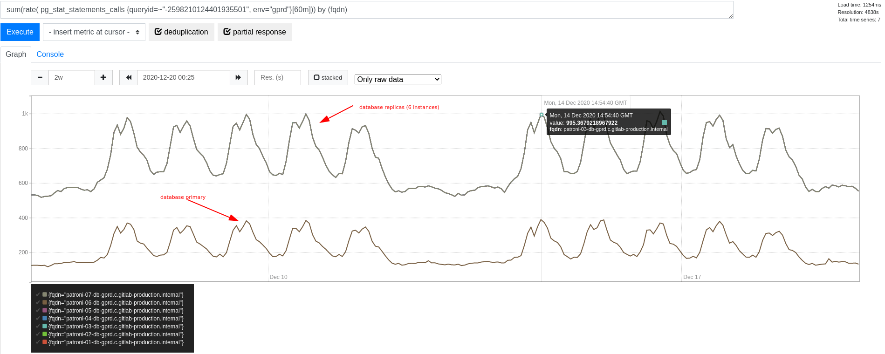
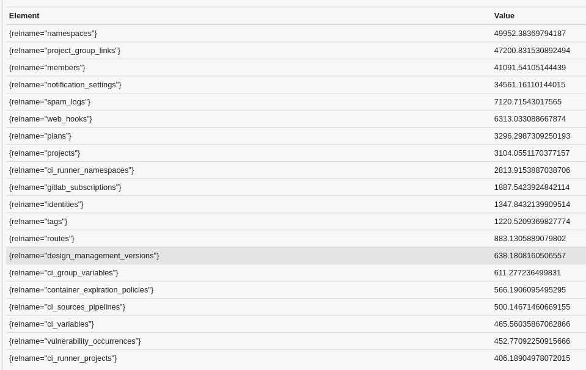
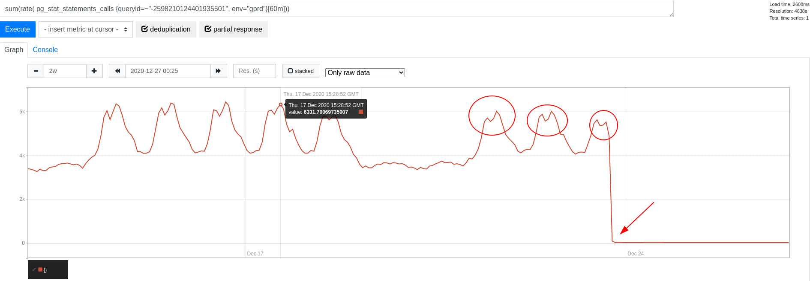

# Read-mostly data

> [Introduced](https://gitlab.com/gitlab-org/gitlab/-/issues/326037) in GitLab 14.0.

This document describes the *read-mostly* pattern introduced in the
[Database Scalability Working Group](https://about.gitlab.com/company/team/structure/working-groups/database-scalability/#read-mostly-data).
We discuss the characteristics of *read-mostly* data and propose best practices for GitLab development
to consider in this context.

## Characteristics of read-mostly data

As the name already suggests, *read-mostly* data is about data that is much more often read than
updated. Writing this data through updates, inserts, or deletes is a very rare event compared to
reading this data.

In addition, *read-mostly* data in this context is typically a small dataset. We explicitly don't deal
with large datasets here, even though they often have a "write once, read often" characteristic, too.

### Example: license data

Let's introduce a canonical example: license data in GitLab. A GitLab instance may have a license
attached to use GitLab enterprise features. This license data is held instance-wide, that
is, there typically only exist a few relevant records. This information is kept in a table
`licenses` which is very small.

We consider this *read-mostly* data, because it follows above outlined characteristics:

- **Rare writes:** license data very rarely sees any writes after having inserted the license.
- **Frequent reads:** license data is read extremely often to check if enterprise features can be used.
- **Small size:** this dataset is very small. On GitLab.com we have 5 records at < 50 kB total relation size.

### Effects of *read-mostly* data at scale

Given this dataset is small and read very often, we can expect data to nearly always reside in
database caches and/or database disk caches. Thus, the concern with *read-mostly* data is typically
not around database I/O overhead, because we typically don't read data from disk anyway.

However, considering the high frequency reads, this has potential to incur overhead in terms of
database CPU load and database context switches. Additionally, those high frequency queries go
through the whole database stack. They also cause overhead on the database connection
multiplexing components and load balancers. Also, the application spends cycles in preparing and
sending queries to retrieve the data, deserialize the results and allocate new objects to represent
the information gathered - all in a high frequency fashion.

In the example of license data above, the query to read license data was
[identified](https://gitlab.com/gitlab-org/gitlab/-/issues/292900) to stand out in terms of query
frequency. In fact, we were seeing around 6,000 queries per second (QPS) on the cluster during peak
times. With the cluster size at that time, we were seeing about 1,000 QPS on each replica, and fewer
than 400 QPS on the primary at peak times. The difference is explained by our
[database load balancing for scaling reads](https://gitlab.com/gitlab-org/gitlab/-/blob/master/ee/lib/gitlab/database/load_balancing.rb),
which favors replicas for pure read-only transactions.



The overall transaction throughput on the database primary at the time varied between 50,000 and
70,000 transactions per second (TPS). In comparison, this query frequency only takes a small
portion of the overall query frequency. However, we do expect this to still have considerable
overhead in terms of context switches. It is worth removing this overhead, if we can.

## How to recognize read-mostly data

It can be difficult to recognize *read-mostly* data, even though there are clear cases like in our
example.

One approach is to look at the [read/write ratio and statistics from, for example, the primary](https://bit.ly/3frdtyz). Here, we look at the TOP20 tables by their read/write ratio over 60 minutes (taken in a peak traffic time):

```plaintext
bottomk(20,
avg by (relname, fqdn) (
  (
      rate(pg_stat_user_tables_seq_tup_read{env="gprd"}[1h])
      +
      rate(pg_stat_user_tables_idx_tup_fetch{env="gprd"}[1h])
  ) /
  (
      rate(pg_stat_user_tables_seq_tup_read{env="gprd"}[1h])
      + rate(pg_stat_user_tables_idx_tup_fetch{env="gprd"}[1h])
      + rate(pg_stat_user_tables_n_tup_ins{env="gprd"}[1h])
      + rate(pg_stat_user_tables_n_tup_upd{env="gprd"}[1h])
      + rate(pg_stat_user_tables_n_tup_del{env="gprd"}[1h])
  )
) and on (fqdn) (pg_replication_is_replica == 0)
)
```

This yields a good impression of which tables are much more often read than written (on the database
primary):



From here, we can [zoom](https://bit.ly/2VmloX1) into for example `gitlab_subscriptions` and realize that index reads peak at above 10k tuples per second overall (there are no seq scans):


We very rarely write to the table (there are no seq scans):


Additionally, the table is only 400 MB in size - so this may be another candidate we may want to
consider in this pattern (see [#327483](https://gitlab.com/gitlab-org/gitlab/-/issues/327483)).

## Best practices for handling read-mostly data at scale

### Cache read-mostly data

To reduce the database overhead, we implement a cache for the data and thus significantly
reduce the query frequency on the database side. There are different scopes for caching available:

- `RequestStore`: per-request in-memory cache (based on [`request_store` gem](https://github.com/steveklabnik/request_store))
- [`ProcessMemoryCache`](https://gitlab.com/gitlab-org/gitlab/blob/master/lib/gitlab/process_memory_cache.rb#L4): per-process in-memory cache (a `ActiveSupport::Cache::MemoryStore`)
- [`Gitlab::Redis::Cache`](https://gitlab.com/gitlab-org/gitlab/blob/master/lib/gitlab/redis/cache.rb) and `Rails.cache`: full-blown cache in Redis

Continuing the above example, we had a `RequestStore` in place to cache license information on a
per-request basis. However, that still leads to one query per request. When we started to cache license information
[using a process-wide in-memory cache](https://gitlab.com/gitlab-org/gitlab/-/merge_requests/50318)
for 1 second, query frequency dramatically dropped:



The choice of caching here highly depends on the characteristics of data in question. A very small
dataset like license data that is nearly never updated is a good candidate for in-memory caching.
A per-process cache is favorable here, because this unties the cache refresh rate from the incoming
request rate.

A caveat here is that our Redis setup is currently not using Redis secondaries and we rely on a
single node for caching. That is, we need to strike a balance to avoid Redis falling over due to
increased pressure. In comparison, reading data from PostgreSQL replicas can be distributed across
several read-only replicas. Even though a query to the database might be more expensive, the
load is balanced across more nodes.

### Read read-mostly data from replica

With or without caching implemented, we also must make sure to read data from database replicas if
we can. This supports our efforts to scale reads across many database replicas and removes
unnecessary workload from the database primary.

GitLab [database load balancing for reads](https://gitlab.com/gitlab-org/gitlab/-/blob/master/ee/lib/gitlab/database/load_balancing.rb)
sticks to the primary after a first write or when opening an
explicit transaction. In the context of *read-mostly* data, we strive to read this data outside of a
transaction scope and before doing any writes. This is often possible given that this data is only
seldom updated (and thus we're often not concerned with reading slightly stale data, for example).
However, it can be non-obvious that this query cannot be sent to a replica because of a previous
write or transaction. Hence, when we encounter *read-mostly* data, it is a good practice to check the
wider context and make sure this data can be read from a replica.
