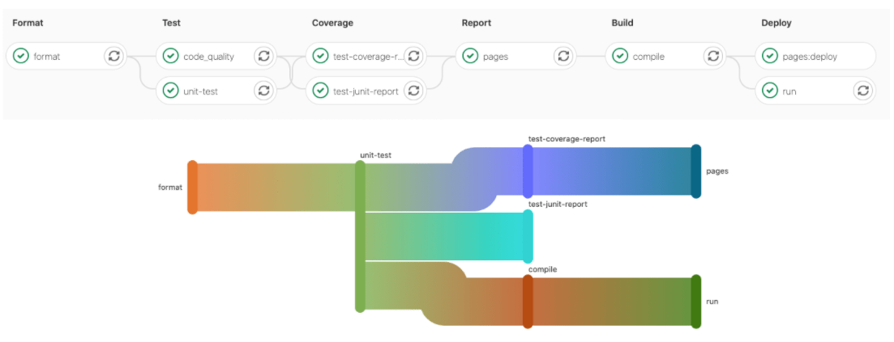
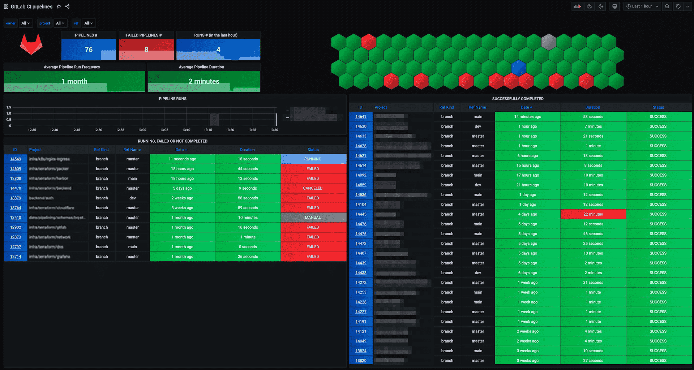

# Pipeline efficiency **(FREE)**

[CI/CD Pipelines](index.md) are the fundamental building blocks for [GitLab CI/CD](../index.md).
Making pipelines more efficient helps you save developer time, which:

- Speeds up your DevOps processes
- Reduces costs
- Shortens the development feedback loop

It's common that new teams or projects start with slow and inefficient pipelines,
and improve their configuration over time through trial and error. A better process is
to use pipeline features that improve efficiency right away, and get a faster software
development lifecycle earlier.

First ensure you are familiar with [GitLab CI/CD fundamentals](../introduction/index.md)
and understand the [quick start guide](../quick_start/index.md).

## Identify bottlenecks and common failures

The easiest indicators to check for inefficient pipelines are the runtimes of the jobs,
stages, and the total runtime of the pipeline itself. The total pipeline duration is
heavily influenced by the:

- [Size of the repository](../large_repositories/index.md)
- Total number of stages and jobs.
- Dependencies between jobs.
- The ["critical path"](#directed-acyclic-graphs-dag-visualization), which represents
  the minimum and maximum pipeline duration.

Additional points to pay attention relate to [GitLab Runners](../runners/index.md):

- Availability of the runners and the resources they are provisioned with.
- Build dependencies and their installation time.
- [Container image size](#docker-images).
- Network latency and slow connections.

Pipelines frequently failing unnecessarily also causes slowdowns in the development
lifecycle. You should look for problematic patterns with failed jobs:

- Flaky unit tests which fail randomly, or produce unreliable test results.
- Test coverage drops and code quality correlated to that behavior.
- Failures that can be safely ignored, but that halt the pipeline instead.
- Tests that fail at the end of a long pipeline, but could be in an earlier stage,
  causing delayed feedback.

## Pipeline analysis

Analyze the performance of your pipeline to find ways to improve efficiency. Analysis
can help identify possible blockers in the CI/CD infrastructure. This includes analyzing:

- Job workloads.
- Bottlenecks in the execution times.
- The overall pipeline architecture.

It's important to understand and document the pipeline workflows, and discuss possible
actions and changes. Refactoring pipelines may need careful interaction between teams
in the DevSecOps lifecycle.

Pipeline analysis can help identify issues with cost efficiency. For example, [runners](../runners/index.md)
hosted with a paid cloud service may be provisioned with:

- More resources than needed for CI/CD pipelines, wasting money.
- Not enough resources, causing slow runtimes and wasting time.

### Pipeline Insights

The [Pipeline success and duration charts](index.md#pipeline-success-and-duration-charts)
give information about pipeline runtime and failed job counts.

Tests like [unit tests](../testing/unit_test_reports.md), integration tests, end-to-end tests,
[code quality](../testing/code_quality.md) tests, and others
ensure that problems are automatically found by the CI/CD pipeline. There could be many
pipeline stages involved causing long runtimes.

You can improve runtimes by running jobs that test different things in parallel, in
the same stage, reducing overall runtime. The downside is that you need more runners
running simultaneously to support the parallel jobs.

The [testing levels for GitLab](../../development/testing_guide/testing_levels.md)
provide an example of a complex testing strategy with many components involved.

### Directed Acyclic Graphs (DAG) visualization

The [Directed Acyclic Graph](../directed_acyclic_graph/index.md) (DAG) visualization can help analyze the critical path in
the pipeline and understand possible blockers.

### Pipeline Monitoring

Global pipeline health is a key indicator to monitor along with job and pipeline duration.
[CI/CD analytics](index.md#pipeline-success-and-duration-charts) give a visual
representation of pipeline health.

Instance administrators have access to additional [performance metrics and self-monitoring](../../administration/monitoring/index.md).

You can fetch specific pipeline health metrics from the [API](../../api/rest/index.md).
External monitoring tools can poll the API and verify pipeline health or collect
metrics for long term SLA analytics.

For example, the [GitLab CI Pipelines Exporter](https://github.com/mvisonneau/gitlab-ci-pipelines-exporter)
for Prometheus fetches metrics from the API and pipeline events. It can check branches in projects automatically
and get the pipeline status and duration. In combination with a Grafana dashboard,
this helps build an actionable view for your operations team. Metric graphs can also
be embedded into incidents making problem resolving easier. Additionally, it can also export metrics about jobs and environments.

If you use the GitLab CI Pipelines Exporter, you should start with the [example configuration](https://github.com/mvisonneau/gitlab-ci-pipelines-exporter/blob/main/docs/configuration_syntax.md).

Alternatively, you can use a monitoring tool that can execute scripts, like
[`check_gitlab`](https://gitlab.com/6uellerBpanda/check_gitlab) for example.

#### Runner monitoring

You can also [monitor CI runners](https://docs.gitlab.com/runner/monitoring/) on
their host systems, or in clusters like Kubernetes. This includes checking:

- Disk and disk IO
- CPU usage
- Memory
- Runner process resources

The [Prometheus Node Exporter](https://prometheus.io/docs/guides/node-exporter/)
can monitor runners on Linux hosts, and [`kube-state-metrics`](https://github.com/kubernetes/kube-state-metrics)
runs in a Kubernetes cluster.

You can also test [GitLab Runner auto-scaling](https://docs.gitlab.com/runner/configuration/autoscale.html)
with cloud providers, and define offline times to reduce costs.

#### Dashboards and incident management

Use your existing monitoring tools and dashboards to integrate CI/CD pipeline monitoring,
or build them from scratch. Ensure that the runtime data is actionable and useful
in teams, and operations/SREs are able to identify problems early enough.
[Incident management](../../operations/incident_management/index.md) can help here too,
with embedded metric charts and all valuable details to analyze the problem.

### Storage usage

Review the storage use of the following to help analyze costs and efficiency:

- [Job artifacts](job_artifacts.md) and their [`expire_in`](../yaml/index.md#artifactsexpire_in)
  configuration. If kept for too long, storage usage grows and could slow pipelines down.
- [Container registry](../../user/packages/container_registry/index.md) usage.
- [Package registry](../../user/packages/package_registry/index.md) usage.

## Pipeline configuration

Make careful choices when configuring pipelines to speed up pipelines and reduce
resource usage. This includes making use of GitLab CI/CD's built-in features that
make pipelines run faster and more efficiently.

### Reduce how often jobs run

Try to find which jobs don't need to run in all situations, and use pipeline configuration
to stop them from running:

- Use the [`interruptible`](../yaml/index.md#interruptible) keyword to stop old pipelines
  when they are superseded by a newer pipeline.
- Use [`rules`](../yaml/index.md#rules) to skip tests that aren't needed. For example,
  skip backend tests when only the frontend code is changed.
- Run non-essential [scheduled pipelines](schedules.md) less frequently.

### Fail fast

Ensure that errors are detected early in the CI/CD pipeline. A job that takes a very long
time to complete keeps a pipeline from returning a failed status until the job completes.

Design pipelines so that jobs that can [fail fast](../testing/fail_fast_testing.md)
run earlier. For example, add an early stage and move the syntax, style linting,
Git commit message verification, and similar jobs in there.

Decide if it's important for long jobs to run early, before fast feedback from
faster jobs. The initial failures may make it clear that the rest of the pipeline
shouldn't run, saving pipeline resources.

### Directed Acyclic Graphs (DAG)

In a basic configuration, jobs always wait for all other jobs in earlier stages to complete
before running. This is the simplest configuration, but it's also the slowest in most
cases. [Directed Acyclic Graphs](../directed_acyclic_graph/index.md) and
[parent/child pipelines](downstream_pipelines.md#parent-child-pipelines) are more flexible and can
be more efficient, but can also make pipelines harder to understand and analyze.

### Caching

Another optimization method is to [cache](../caching/index.md) dependencies. If your
dependencies change rarely, like [NodeJS `/node_modules`](../caching/index.md#cache-nodejs-dependencies),
caching can make pipeline execution much faster.

You can use [`cache:when`](../yaml/index.md#cachewhen) to cache downloaded dependencies
even when a job fails.

### Docker Images

Downloading and initializing Docker images can be a large part of the overall runtime
of jobs.

If a Docker image is slowing down job execution, analyze the base image size and network
connection to the registry. If GitLab is running in the cloud, look for a cloud container
registry offered by the vendor. In addition to that, you can make use of the
[GitLab container registry](../../user/packages/container_registry/index.md) which can be accessed
by the GitLab instance faster than other registries.

#### Optimize Docker images

Build optimized Docker images because large Docker images use up a lot of space and
take a long time to download with slower connection speeds. If possible, avoid using
one large image for all jobs. Use multiple smaller images, each for a specific task,
that download and run faster.

Try to use custom Docker images with the software pre-installed. It's usually much
faster to download a larger pre-configured image than to use a common image and install
software on it each time. The Docker [Best practices for writing Dockerfiles article](https://docs.docker.com/develop/develop-images/dockerfile_best-practices/)
has more information about building efficient Docker images.

Methods to reduce Docker image size:

- Use a small base image, for example `debian-slim`.
- Do not install convenience tools such as vim or curl if they aren't strictly needed.
- Create a dedicated development image.
- Disable man pages and docs installed by packages to save space.
- Reduce the `RUN` layers and combine software installation steps.
- Use [multi-stage builds](https://blog.alexellis.io/mutli-stage-docker-builds/)
  to merge multiple Dockerfiles that use the builder pattern into one Dockerfile, which can reduce image size.
- If using `apt`, add `--no-install-recommends` to avoid unnecessary packages.
- Clean up caches and files that are no longer needed at the end. For example
  `rm -rf /var/lib/apt/lists/*` for Debian and Ubuntu, or `yum clean all` for RHEL and CentOS.
- Use tools like [dive](https://github.com/wagoodman/dive) or [DockerSlim](https://github.com/docker-slim/docker-slim)
  to analyze and shrink images.

To simplify Docker image management, you can create a dedicated group for managing
[Docker images](../docker/index.md) and test, build and publish them with CI/CD pipelines.

## Test, document, and learn

Improving pipelines is an iterative process. Make small changes, monitor the effect,
then iterate again. Many small improvements can add up to a large increase in pipeline
efficiency.

It can help to document the pipeline design and architecture. You can do this with
[Mermaid charts in Markdown](../../user/markdown.md#mermaid) directly in the GitLab
repository.

Document CI/CD pipeline problems and incidents in issues, including research done
and solutions found. This helps onboarding new team members, and also helps
identify recurring problems with CI pipeline efficiency.

### Learn More

- [CI Monitoring Webcast Slides](https://docs.google.com/presentation/d/1ONwIIzRB7GWX-WOSziIIv8fz1ngqv77HO1yVfRooOHM/edit?usp=sharing)
- [GitLab.com Monitoring Handbook](https://about.gitlab.com/handbook/engineering/monitoring/)
- [Buildings dashboards for operational visibility](https://aws.amazon.com/builders-library/building-dashboards-for-operational-visibility/)
