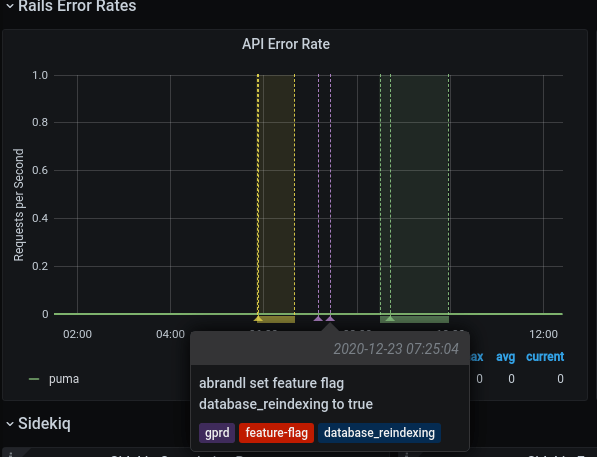

# Dashboards for stage groups

We generate a lot of dashboards acting as windows to the metrics we
use to monitor GitLab.com. Most of our dashboards are generated from
Jsonnet in the
[runbooks repository](https://gitlab.com/gitlab-com/runbooks/-/tree/master/dashboards#dashboard-source).
Anyone can contribute to these, adding new dashboards or modifying
existing ones.

When adding new dashboards for your stage groups, tagging them with
`stage_group:<group name>` cross-links the dashboard on other
dashboards with the same tag. You can create dashboards for stage groups
in the [`dashboards/stage-groups`](https://gitlab.com/gitlab-com/runbooks/-/tree/master/dashboards/stage-groups)
directory. Directories can't be nested more than one level deep.

To see a list of all the dashboards for your stage group:

1. In Grafana, go to the [Dashboard browser](https://dashboards.gitlab.net/dashboards?tag=stage-groups).
1. To see all of the dashboards for a specific group, filter for `stage_group:<group name>`.

Some generated dashboards are already available:

1. [Stage group dashboard](stage_group_dashboard.md): a customizable
   dashboard with tailored metrics per group.
1. [Error budget detail dashboard](error_budget_detail.md): a
   dashboard allowing to explore the error budget spend over time and
   over multiple SLIs.

## Time range controls

By default, all the times are in UTC time zone.
[We use UTC when communicating in Engineering.](https://about.gitlab.com/handbook/communication/#writing-style-guidelines)

All metrics recorded in the GitLab production system have
[one-year retention](https://gitlab.com/gitlab-cookbooks/gitlab-prometheus/-/blob/31526b03fef823e2f9b3cda7c75dcd28a12418a3/attributes/prometheus.rb#L40).

You can also zoom in and filter the time range directly on a graph. For more information, see the
[Grafana Time Range Controls](https://grafana.com/docs/grafana/latest/dashboards/use-dashboards/#set-dashboard-time-range)
documentation.

## Filters and annotations

On each dashboard, there are two filters and some annotation switches on the top of the page.

Some special events are meaningful to development and operational activities.
[Grafana annotations](https://grafana.com/docs/grafana/latest/dashboards/build-dashboards/annotate-visualizations/) mark them
directly on the graphs.

| Name            | Type       | Description |
| --------------- | ---------- | ----------- |
| `PROMETHEUS_DS` | filter     | Filter the selective [Prometheus data sources](https://about.gitlab.com/handbook/engineering/monitoring/#prometheus). The default value is `Global`, which aggregates the data from all available data sources. Most of the time, you don't need to care about this filter. |
| `environment`   | filter     | Filter the environment the metrics are fetched from. The default setting is production (`gprd`). For other options, see [Production Environment mapping](https://about.gitlab.com/handbook/engineering/infrastructure/production/architecture/#environments). |
| `stage`         | filter     | Filter metrics by stage: `main` or `cny` for canary. Default is `main` |
| `deploy`        | annotation | Mark a deployment event on the GitLab.com SaaS platform. |
| `canary-deploy` | annotation | Mark a [canary deployment](https://about.gitlab.com/handbook/engineering/#canary-testing) event on the GitLab.com SaaS platform. |
| `feature-flags` | annotation | Mark the time point when a feature flag is updated. |

Example of a feature flag annotation displayed on a dashboard panel:

