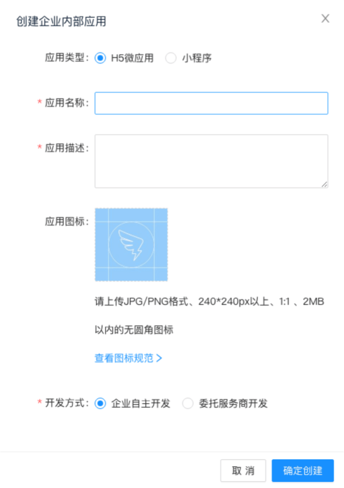
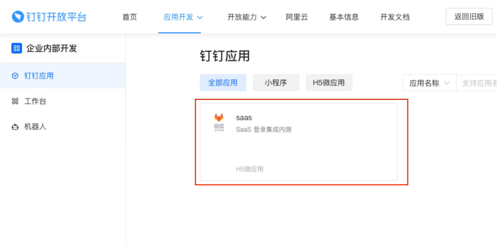

# DingTalk OAuth 2.0 OmniAuth provider **(FREE SELF)**

> [Introduced](https://gitlab.com/gitlab-org/gitlab/-/issues/341898) in GitLab 14.5.

You can sign in to GitLab using your DingTalk account.
Sign in to DingTalk Open Platform and create an application on it. DingTalk generates a client ID and secret key for you to use.

1. Sign in to [DingTalk Open Platform](https://open-dev.dingtalk.com/).

1. On the top bar, select **Application development > Enterprise internal development** and then select **Create Application**.

   

1. Fill in the application details:

   - **Application Name**: This can be anything. Consider something like `<Organization>'s GitLab`, `<Your Name>'s GitLab`, or something else descriptive.
   - **Application Description**: Create a description.
   - **Application icon**: Upload qualified icons if needed.

   

1. Select **Confirm and create**.

1. On the left sidebar, select **DingTalk Application** and find your application. Select it and go to the application information page.

   

1. In the **Application Credentials** section, note the **AppKey** and **AppSecret** as you use these values later.

   

1. On your GitLab server, open the configuration file.

   For Omnibus package:

   ```shell
   sudo editor /etc/gitlab/gitlab.rb
   ```

   For installations from source:

   ```shell
   cd /home/git/gitlab

   sudo -u git -H editor config/gitlab.yml
   ```

1. Edit the [common configuration file settings](omniauth.md#configure-common-settings)
   to add `dingtalk` as a single sign-on provider. This enables Just-In-Time
   account provisioning for users who do not have an existing GitLab account.

1. Add the provider configuration:

   For Omnibus package:

   ```ruby
     gitlab_rails['omniauth_providers'] = [
       {
         name: "dingtalk",
         # label: "Provider name", # optional label for login button, defaults to "Ding Talk"
         app_id: "<your_appkey>",
         app_secret: "<your_appsecret>"
       }
     ]
   ```

   For installations from source:

   ```yaml
   - { name: 'dingtalk',
       # label: 'Provider name', # optional label for login button, defaults to "Ding Talk"
       app_id: '<your_appkey>',
       app_secret: '<your_appsecret>' }
   ```

1. Replace `<your_appkey>` with the AppKey from the  **Application Credentials** in step 6.

1. Replace `<your_appsecret>` with the AppSecret from the **Application Credentials** in step 6.

1. Save the configuration file.

1. For the changes to take effect, if you installed:
   - Using Omnibus, [reconfigure GitLab](../administration/restart_gitlab.md#omnibus-gitlab-reconfigure).
   - From source, [restart GitLab](../administration/restart_gitlab.md#installations-from-source).
